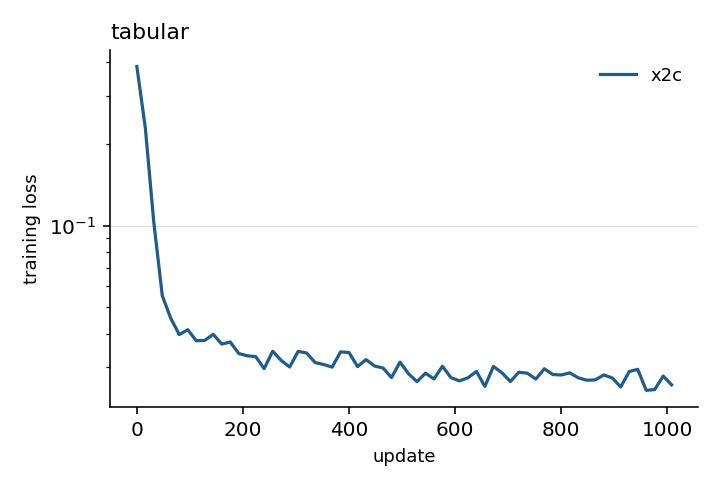
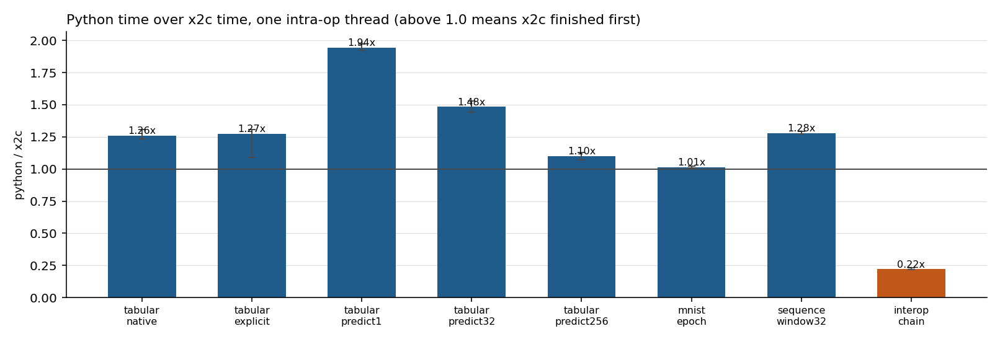
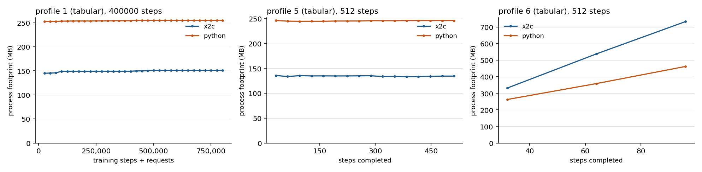
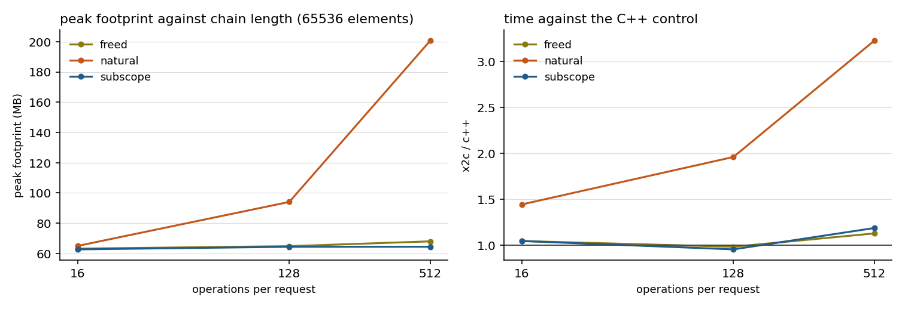

# Matched x2c and PyTorch applications: results

Three applications and one diagnostic, the same work on both sides, run
live in fresh processes on one idle machine. The plan is
[plans/x2c-torch-comparison.md](../../../plans/x2c-torch-comparison.md);
how to reproduce any line of this is [README.md](README.md), and
[PILOT.md](PILOT.md) holds the earlier single-sample pass and the gaps it
found.

The timings below include the tabular explicit lane whose long-run loss
comparison failed. There is no aggregate speedup in this report: the four
workloads answer different questions and their verdicts are separate.

## Acceptance review, 2026-09-10

These historical measurements predate the comparison-runner repair. Its
old tensor comparison scaled tolerance by the largest tensor element,
accepted approximate integer values, and could pass missing check outputs.
The runner now checks elementwise tolerance, exact integer/metadata values,
matching keys/shapes/dtypes, complete records, fresh checkpoints, and task
quality. The raw checkpoints and session JSON named below were not present
in the linked worktrees during this review, so these historical numbers
have not been revalidated with the repaired runner. They are retained as
recorded; this finding does not establish that their calculated values
were wrong. The reported tabular explicit tolerance failure remains open.

## What ran

- Tree `9c36b76221174eb76f005658a0e4ad9abe2d6eca` plus uncommitted changes, `x2c 0.12.0`.
- macOS-15.7.9-arm64-arm-64bit, Apple M4 Max, 16 physical and 16 logical cores.
- Build lane `primary`, prefix `/Users/gary/Git/Bonsai-demo/.venv/lib/python3.11/site-packages/torch`, handle counters on.
  - `libtorch_cpu.dylib` 214082912 bytes, SHA-256 `941f3e16a8e02b23`
  - `libtorch.dylib` 16736 bytes, SHA-256 `2178657b7eeffc0c`
  - `libc10.dylib` 1084640 bytes, SHA-256 `f203c171b7a71c74`
- Python at `/Users/gary/Git/Bonsai-demo/.venv/bin/python`, torch pinned at 2.10.0.
- Artifacts, SHA-256 prefixes: `interop-init.pt 7d2ca9e5c1bc`, `mnist-batches.pt d13f17c6f88a`, `mnist-init.pt 8f855dfc9ea5`, `sequence-data.pt 72665ed75b42`, `sequence-init.pt 939cffb5ef4a`, `tabular-batches.pt ebaf4a532b32`, `tabular-data.pt a9465db47665`, `tabular-init.pt bf60a5298a61`.

## Correctness

One update with every value kept is the decisive check: outputs, loss, every gradient, every parameter and buffer afterwards, against `atol=1e-6, rtol=1e-4`.

| Lane | Tensors compared after one update | Worst absolute | Verdict |
| --- | --- | --- | --- |
| mnist | 32 | 0.000e+00 | bit-identical |
| sequence | 12 | 0.000e+00 | bit-identical |
| tabular | 14 | 0.000e+00 | bit-identical |

Task quality and the plan's `1e-3` relative loss tolerance:

| Lane | Measure | x2c | Python | Relative | Verdict |
| --- | --- | --- | --- | --- | --- |
| interop | chain_e1_o128 | 0.83724821 | 0.83724821 | 0.00e+00 | ok |
| interop | chain_e1_o16 | 0.79481524 | 0.79481524 | 0.00e+00 | ok |
| interop | chain_e1_o512 | 0.88197315 | 0.88197315 | 0.00e+00 | ok |
| interop | chain_e4096_o128 | 2113.1189 | 2113.1189 | 0.00e+00 | ok |
| interop | chain_e4096_o16 | 1618.4708 | 1618.4708 | 0.00e+00 | ok |
| interop | chain_e4096_o512 | 3626.7097 | 3626.7097 | 0.00e+00 | ok |
| interop | chain_e64_o128 | 39.357796 | 39.357796 | 0.00e+00 | ok |
| interop | chain_e64_o16 | 28.929104 | 28.929104 | 0.00e+00 | ok |
| interop | chain_e64_o512 | 63.224529 | 63.224529 | 0.00e+00 | ok |
| interop | chain_e65536_o128 | 34553.102 | 34553.102 | 0.00e+00 | ok |
| interop | chain_e65536_o16 | 26398.844 | 26398.844 | 0.00e+00 | ok |
| interop | chain_e65536_o512 | 60244.285 | 60244.285 | 0.00e+00 | ok |
| interop | interop_threads | 1 | 1 | 0.00e+00 | ok |
| mnist | data_checksum | -6262.4365 | -6262.4365 | 0.00e+00 | ok |
| mnist | interop_threads | 1 | 1 | 0.00e+00 | ok |
| mnist | mode_after_reload | 1 | 1 | 0.00e+00 | ok |
| mnist | probe_loss | 2.3025608 | 2.3025608 | 0.00e+00 | ok |
| mnist | reloaded_accuracy | 0.9865 | 0.9861 | 4.05e-04 | ok |
| mnist | test_checksum | -21465.027 | -21465.027 | 0.00e+00 | ok |
| mnist | trained_accuracy | 0.9865 | 0.9861 | 4.05e-04 | ok |
| mnist | untrained_accuracy | 0.0874 | 0.0874 | 0.00e+00 | ok |
| sequence | interop_threads | 1 | 1 | 0.00e+00 | ok |
| sequence | last_value_val_mse | 0.0021322735 | 0.0021322735 | 0.00e+00 | ok |
| sequence | mean_val_mse | 0.29780677 | 0.29780677 | 0.00e+00 | ok |
| sequence | probe_loss | 0.27235726 | 0.27235726 | 0.00e+00 | ok |
| sequence | resumed_val_mse | 0.052497877 | 0.052497871 | 1.08e-07 | ok |
| sequence | trained_val_mse | 0.052508756 | 0.052508751 | 1.04e-07 | ok |
| sequence | untrained_val_mse | 0.32913961 | 0.32913961 | 0.00e+00 | ok |
| sequence | window128_val_mse | 0.1410817 | 0.1410817 | 1.85e-08 | ok |
| sequence | window32_val_mse | 0.14179125 | 0.14179124 | 2.88e-08 | ok |
| sequence | window8_val_mse | 0.14052584 | 0.14052583 | 3.84e-08 | ok |
| tabular | explicit_val_mse | 0.032052495 | 0.032124087 | 2.23e-03 | **over tolerance** |
| tabular | interop_threads | 1 | 1 | 0.00e+00 | ok |
| tabular | mean_val_mse | 0.33111256 | 0.33111256 | 0.00e+00 | ok |
| tabular | predict1_checksum | 948.31848 | 948.52136 | 2.14e-04 | ok |
| tabular | predict256_checksum | 239999.31 | 240050.58 | 2.14e-04 | ok |
| tabular | predict32_checksum | 29976.425 | 29983.971 | 2.52e-04 | ok |
| tabular | probe_loss | 0.38660234 | 0.38660234 | 0.00e+00 | ok |
| tabular | resumed_val_mse | 0.032104194 | 0.032085128 | 5.94e-04 | ok |
| tabular | trained_val_mse | 0.032104194 | 0.032085128 | 5.94e-04 | ok |
| tabular | untrained_val_mse | 0.36317796 | 0.36317796 | 0.00e+00 | ok |

Failed tolerances, kept as failures rather than relaxed:

- `tabular` `explicit_val_mse`: relative 2.23e-03 against a 1e-3 limit.

Per-weight equality after the full profile is reported, not required; float32 training separates from a one-ulp difference. Worst absolute difference at the end: `mnist` 2.95e+00, `sequence` 1.19e-07, `tabular` 6.83e-02.



## Timing

5 fresh-process pairs per configuration, alternating which language ran first, medians below. `python/x2c` above 1 means x2c finished first. Spread is (max - min) / median.

| Lane | Threads | Count | x2c median (s) | spread | Python median (s) | spread | python/x2c |
| --- | --- | --- | --- | --- | --- | --- | --- |
| tabular native | 1 | 60000 | 11.8036 | 3.1% | 14.8422 | 2.3% | 1.26x |
| tabular native | 4 | 60000 | 14.0686 | 3.6% | 18.1605 | 3.9% | 1.29x |
| tabular explicit | 1 | 60000 | 12.6219 | 10.8% | 16.0578 | 7.4% | 1.27x |
| tabular explicit | 4 | 60000 | 14.3110 | 2.4% | 18.1324 | 2.6% | 1.27x |
| tabular predict1 | 1 | 900000 | 7.2938 | 1.5% | 14.1663 | 0.9% | 1.94x |
| tabular predict1 | 4 | 900000 | 7.3011 | 2.9% | 14.1688 | 1.0% | 1.94x |
| tabular predict32 | 1 | 520000 | 8.6893 | 2.8% | 12.8810 | 3.1% | 1.48x |
| tabular predict32 | 4 | 520000 | 8.5595 | 2.5% | 12.6363 | 1.6% | 1.48x |
| tabular predict256 | 1 | 210000 | 11.3508 | 3.2% | 12.4907 | 2.4% | 1.10x |
| tabular predict256 | 4 | 210000 | 17.3120 | 2.5% | 17.9414 | 1.1% | 1.04x |
| mnist epoch | 1 | 1150 | 13.8040 | 0.5% | 14.0034 | 0.9% | 1.01x |
| mnist epoch | 4 | 1150 | 9.5753 | 1.0% | 9.9158 | 1.5% | 1.04x |
| sequence window32 | 1 | 6800 | 10.6949 | 0.6% | 13.6539 | 0.9% | 1.28x |
| sequence window32 | 4 | 6800 | 10.9030 | 0.9% | 13.7880 | 0.5% | 1.26x |
| interop chain | 1 | 190 | 11.4376 | 1.6% | 2.5271 | 4.1% | 0.22x |
| interop chain | 4 | 190 | 14.9514 | 1.7% | 5.8128 | 0.8% | 0.39x |



## Memory

| Profile | App | Steps | x2c start (MB) | x2c end (MB) | x2c peak (MB) | Python peak (MB) | x2c/Python peak |
| --- | --- | --- | --- | --- | --- | --- | --- |
| 1 | tabular | 512 | 61.2 | 136.8 | 137.4 | 249.7 | 0.55x |
| 1 | tabular | 100000 | 59.6 | 139.2 | 139.2 | 258.1 | 0.54x |
| 1 | tabular | 200000 | 57.7 | 146.9 | 146.9 | 258.9 | 0.57x |
| 1 | tabular | 400000 | 60.4 | 150.6 | 150.6 | 257.7 | 0.58x |
| 3 | tabular | 512 | 59.8 | 196.4 | 196.4 | 247.5 | 0.79x |
| 4 | sequence | 64 | 60.0 | 95.5 | 105.1 | 249.3 | 0.42x |
| 5 | tabular | 512 | 58.8 | 136.7 | 139.8 | 249.3 | 0.56x |
| 6 | tabular | 512 | 59.4 | 135.0 | 895.7 | 564.7 | 1.59x |

Profile 1 at N, 2N, and 4N steps in fresh processes, which is the plan's bounded-memory test. The rate is measured over the second half of each run, after warmup:

| Steps | x2c end (MB) | x2c bytes/1,000 steps | Python end (MB) | Python bytes/1,000 steps |
| --- | --- | --- | --- | --- |
| 100000 | 139.2 | 0 | 258.1 | 82,390 |
| 200000 | 146.9 | 0 | 258.9 | 9,737 |
| 400000 | 150.6 | 6,273 | 257.7 | 3,183 |

Owner counts on the x2c side, start to end of each run. A fixed workload should return them to where it found them:

- Profile 1, 512 steps: live Scope allocations 20 to 54, live scopes 5 to 5, canonical pool 13312 to 17408 bytes.
- Profile 1, 100000 steps: live Scope allocations 20 to 54, live scopes 5 to 5, canonical pool 13312 to 17408 bytes.
- Profile 1, 200000 steps: live Scope allocations 20 to 54, live scopes 5 to 5, canonical pool 13312 to 17408 bytes.
- Profile 1, 400000 steps: live Scope allocations 20 to 54, live scopes 5 to 5, canonical pool 13312 to 17408 bytes.
- Profile 3, 512 steps: live Scope allocations 20 to 49, live scopes 5 to 5, canonical pool 13312 to 17408 bytes.
- Profile 4, 64 steps: live Scope allocations 20 to 64, live scopes 5 to 5, canonical pool 12288 to 21504 bytes.
- Profile 5, 512 steps: live Scope allocations 20 to 46, live scopes 5 to 5, canonical pool 13312 to 35328 bytes.
- Profile 6, 512 steps: live Scope allocations 20 to 53, live scopes 5 to 5, canonical pool 13312 to 19968 bytes.



## What the interop cost is made of

The same chain at 65536 elements under three lifetimes, one fresh process each, against a C++ control running the identical ATen sequence with no wrapper. `natural` is one scope per request, `freed` releases each value it replaces, `subscope` is one scope per operation carrying only the running value. All three produce the same result exactly.

| Lifetime | Ops per request | ns per step | vs C++ | Live tensor handles | Peak footprint (MB) |
| --- | --- | --- | --- | --- | --- |
| natural | 16 | 48145 | 2.70x | 61 | 64.9 |
| natural | 128 | 87801 | 5.80x | 397 | 164.5 |
| natural | 512 | 77722 | 4.33x | 1549 | 205.2 |
| freed | 16 | 41884 | 2.35x | 46 | 59.2 |
| freed | 128 | 62773 | 4.14x | 270 | 130.5 |
| freed | 512 | 63965 | 3.56x | 1038 | 275.8 |
| subscope | 16 | 22608 | 1.27x | 14 | 58.7 |
| subscope | 128 | 18907 | 1.25x | 14 | 63.4 |
| subscope | 512 | 16495 | 0.92x | 14 | 65.8 |
| c++ control | 16 | 17823 | 1.00x | n/a | n/a |
| c++ control | 128 | 15145 | 1.00x | n/a | n/a |
| c++ control | 512 | 17959 | 1.00x | n/a | n/a |



## Findings

The sections above are generated from one session's raw JSON. This one is
written by hand: it explains those numbers and records what the suite
exposed.

### Per-workload verdicts

- **Tabular training.** x2c finishes first at both thread counts, on both
  the native-Linear forward and the documented enumerated-parameter one.
  The two forwards are within a few percent of each other inside each
  language, so parameter enumeration is not what separates them.
- **Batched prediction.** x2c's margin is largest at batch 1 and is gone
  by batch 256, which is the expected shape: the per-request cost x2c
  avoids is fixed, and by 256 rows the kernels dominate.
- **MNIST.** Parity. This is the kernel-heavy case, and once convolution
  and batch normalization own the time there is nothing left for a
  wrapper or an interpreter to win or lose.
- **Sequence.** x2c finishes first by about the same margin as tabular
  training. A window is 32 small steps, so per-call cost still matters.
- **Interop.** The headline `chain` timing is x2c's worst result in the
  suite, and it is entirely a lifetime effect.

### The interop cost is retention, not wrapper overhead

The attribution table runs the identical chain three ways. Written the
documented way, one scope per request, every intermediate stays alive
until the request ends: at 65,536 elements and 512 operations that is
1,549 live tensor handles and a peak footprint of 205 MB, and the chain
runs 4.33x the C++ control. Releasing each value as it is replaced with
`Tensor.free` recovers part of it. One scope per operation, carrying only
the running value out with `Scope.move`, holds 14 handles and a flat
59-66 MB at every chain length and runs at 0.92x to 1.27x the control -
parity with C++ calling ATen directly, with no wrapper cost left to find.
All three lifetimes produce the same result exactly.

So the wrapper is not the cost. The cost is that a scope is the unit of
release, and a long chain inside one scope holds every intermediate the
mathematics no longer needs. Python's reference counting frees them as it
goes and never pays it. Nothing here is unattributed.

This is a caller obligation with a cheap remedy that does not change the
result, and it is worth stating plainly in the package documentation: a
long out-of-place chain over large tensors inside a single scope is the
one shape where the ordinary idiom is expensive.

### Adam is not the same algorithm in the two languages

Both implementations produce bit-identical outputs, losses, gradients and
parameters for one update. They part at the second, and the `trace` mode
locates it exactly: at update 1 the batch, every forward intermediate,
the loss and every gradient are still bit-identical, and only the
parameters after the optimizer step differ, by 7.45e-09.

`torch.optim.Adam` updates the first moment with
`exp_avg.lerp_(grad, 1 - beta1)`; libtorch's C++ `Adam` uses
`exp_avg.mul_(beta1).add_(grad, 1 - beta1)`. The two agree in exact
arithmetic, and in float32 while `exp_avg` is still zero, which is why
the first update matches and the second does not. Replaying the same
training in Python with the `mul_`/`add_` form reproduces the x2c result
bit for bit; the `lerp_` form does not.

`foreach=False, fused=False` is therefore not enough to match the two
optimizers, and the plan's requirement to match Python's Adam to the C++
algorithm cannot be fully met through `torch.optim.Adam`. Nothing was
relaxed to hide this: the long-run losses still agree within the stated
tolerance in every lane except the tabular `explicit` one, which stands
above as a failed tolerance.

Reproducer:

```sh
python3 packages/torch/benchmarks/firstdiff.py --variant explicit     --first 0 --last 4
```

### Memory

Steady training and inference are flat in both languages once warm, with
x2c's whole-process footprint a little over half Python's, mostly the
interpreter and `libtorch_python.dylib`. Live Scope allocations and live
scopes return to their starting values in every profile, including the
one that injects a bad shape inside a deferred scope every 100 requests
and then checks that ordinary work and the model's mode survive it.

The positive control works: retaining forward graphs on purpose grows
both languages to the 128 MiB payload cap and both release fully
afterwards, so the measurement is shown to see a known problem. x2c grows
about twice as fast per retained graph, for the same reason as interop -
Python holds the activations the graph needs, and x2c additionally holds
every pre-activation intermediate until the enclosing scope closes.

One thing grows that need not. In the repeated
create-train-save-load-destroy profile the canonical pool's active bytes
rise about 64 bytes per cycle, because each cycle builds its checkpoint
path with an interpolated String and Strings survive scope release.
Hoisting the path out of the loop removes it. That is the cost of
building the same String repeatedly, not a leak in the pool.

### Gaps

1. **A `#define` numeric constant does not resolve an operator row.**
   `(images - MEAN) / STD` with `#define MEAN 0.1307` emits the C text
   unchanged and fails to compile; a `double` local works. Reproducer:
   `#define M 0.5` then
   `Tensor y = Tensor.zeros(%(2 2), XT_FLOAT32) - M;`.
2. **`Checkpoint.save` crashes on a released Tensor.** A `Map` outlives
   the scope that created the Tensors it holds, so storing one, releasing
   that scope, then saving reaches `tensors[i]->t.detach()` on a freed
   handle instead of raising `<bad-state>`. Using a released wrapper is a
   documented caller error, so this is robustness rather than a defect;
   yyjson raises for the same class of stale access.
3. **Inter-op thread control** was missing when the pilot ran and is now
   in the package as `Torch.set_num_interop_threads`. Both languages in
   this session pin it to 1 before any work and record what they got.
4. **Per-type native handle counters** were missing and are now present
   as the private, benchmark-only instrumentation `README.md` describes.
   They are what made the interop attribution possible.
5. **A composed root has no forward**, so the tabular lane looks its
   three children up once and indexes a List. That is what
   `Module.sequential` exists for and the MNIST lane uses it; the MLP
   lane keeps the composed form the package README documents.


## Operator temporaries after discard

Measured 2026-09-10 on the same machine, primary lane, one intra-op thread,
after the compiler change that discards an unnamed operator or numeric
converter result right after the operator or method call that consumes it
(`discard` protocol row; `Tensor.discard` releases the libtorch handle).
Nothing above includes it. The interop chain is `y = (y * a + b).relu()`,
so per step the product is discarded by the addition, the sum by `relu`,
and only the reassigned loop variable `y` waits for the scope.

Attribution at 65,536 elements, ns per step against the C++ control:

| Lifetime | 16 ops | 128 ops | 512 ops | peak MB (512) |
| --- | --- | --- | --- | --- |
| natural, before | 2.05x | 3.40x | 4.33x | 290 |
| natural, after | 1.35x | 1.88x | 2.56x | 198 |
| freed as you go, after | 1.31x | 1.16x | 1.10x | 64 |
| subscope, after | 1.19x | 0.98x | 0.87x | 66 |

Paired timing, interop chain, 190 requests, 3 fresh-process pairs:

| | x2c median | Python median | python/x2c |
| --- | --- | --- | --- |
| before (5-sample session) | 11.44 s | 2.53 s | 0.22x |
| after | 5.91 s (spread 6.7%) | 2.63 s (spread 12.7%) | 0.44x |

The three lifetimes still agree exactly on every result. What remains in
the natural shape is the value a loop variable held before it was
reassigned: the compiler discards only values it made for one operator or
call, never a named value, so `y`'s previous tensor lives until the request
scope ends. Freeing it explicitly before the assignment reaches 1.10x, and
one scope per step 0.87x. That is a caller idiom, documented in the package
README's lifetime section; an automatic release of a reassigned local would
need a proof that no alias survives, which the language does not attempt.
Raw samples: `debug/torch-comparison/discard2/`.

## Raw data

Every number above comes from `debug/torch-comparison/session/`: `check.json`, `timing.json`, `memory.json`, `attribution.json`, and `environment.json`, beside one log per launched process. The plots are rendered from those same files by `plots.py session`.
