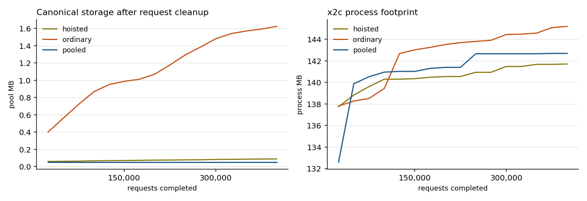

# x2c and PyTorch applications: results

Three applications and one diagnostic, the same work on both sides, run
live in fresh processes on one machine. [README.md](README.md) gives the
method, plan, and reproduction commands;
[PILOT.md](PILOT.md) holds the earlier single-sample pass and the gaps it
found.

Read the correctness results alongside the timings: a measured timing is
not evidence that a configuration passed. There is no aggregate speedup in
this report; the workloads and their verdicts are separate.

[Supplemental diagnostics](SUPPLEMENT.md) separately measure startup,
training phases, error-message interning, corrected sequence ownership,
and all four interop sizes. Its separate MNIST correction supersedes only
the two original 20-warmup timing rows; all original records remain intact.

Optimizer comparison: **stock**.

Python uses stock PyTorch Adam. Its numerical divergence is reported below; failed tolerances remain failures.

[The matched control](MATCHED.md) reports the separate libtorch operation-order correctness comparison.

## What ran

- Tree `2b7a63cbb2270eaf1ceba98b31b089fcae56850f` plus uncommitted changes, `x2c 0.12.0`.
- macOS-15.7.9-arm64-arm-64bit-Mach-O, Apple M4 Max, 16 physical and 16 logical cores.
- Build lane `primary`, prefix `/Users/gary/Git/Bonsai-demo/.venv/lib/python3.11/site-packages/torch`, handle counters off.
  - `libtorch_cpu.dylib` 214082912 bytes, SHA-256 `941f3e16a8e02b23`
  - `libtorch.dylib` 16736 bytes, SHA-256 `2178657b7eeffc0c`
  - `libc10.dylib` 1084640 bytes, SHA-256 `f203c171b7a71c74`
- Python at `/Users/gary/Git/Bonsai-demo/.venv/bin/python`, torch `2.10.0`.
- Artifacts, SHA-256 prefixes: `interop-init.pt 7d2ca9e5c1bc`, `mnist-batches.pt d13f17c6f88a`, `mnist-init.pt 8f855dfc9ea5`, `sequence-data.pt 72665ed75b42`, `sequence-init.pt 939cffb5ef4a`, `tabular-batches.pt ebaf4a532b32`, `tabular-data.pt a9465db47665`, `tabular-init.pt bf60a5298a61`.

## Correctness

One update with every value kept is the decisive check: outputs, loss, every gradient, every parameter and buffer afterwards, against `atol=1e-6, rtol=1e-4`.

| Lane | Tensors compared after one update | Worst absolute | Verdict |
| --- | --- | --- | --- |
| mnist | 32 | 0.000e+00 | bit-identical |
| sequence | 12 | 0.000e+00 | bit-identical |
| tabular | 14 | 0.000e+00 | bit-identical |

- **tabular failed:** explicit_val_mse: values disagree

Task quality and the plan's `1e-3` relative loss tolerance:

| Lane | Measure | x2c | Python | Relative | Verdict |
| --- | --- | --- | --- | --- | --- |
| interop | chain_e1_o128 | 0.83724821 | 0.83724821 | 0.00e+00 | ok |
| interop | chain_e1_o16 | 0.79481524 | 0.79481524 | 0.00e+00 | ok |
| interop | chain_e1_o512 | 0.88197315 | 0.88197315 | 0.00e+00 | ok |
| interop | chain_e4096_o128 | 2113.1189 | 2113.1189 | 0.00e+00 | ok |
| interop | chain_e4096_o16 | 1618.4708 | 1618.4708 | 0.00e+00 | ok |
| interop | chain_e4096_o512 | 3626.7097 | 3626.7097 | 0.00e+00 | ok |
| interop | chain_e64_o128 | 39.357796 | 39.357796 | 0.00e+00 | ok |
| interop | chain_e64_o16 | 28.929104 | 28.929104 | 0.00e+00 | ok |
| interop | chain_e64_o512 | 63.224529 | 63.224529 | 0.00e+00 | ok |
| interop | chain_e65536_o128 | 34553.102 | 34553.102 | 0.00e+00 | ok |
| interop | chain_e65536_o16 | 26398.844 | 26398.844 | 0.00e+00 | ok |
| interop | chain_e65536_o512 | 60244.285 | 60244.285 | 0.00e+00 | ok |
| interop | interop_threads | 1 | 1 | 0.00e+00 | ok |
| mnist | data_checksum | -6262.4365 | -6262.4365 | 0.00e+00 | ok |
| mnist | interop_threads | 1 | 1 | 0.00e+00 | ok |
| mnist | mode_after_reload | 1 | 1 | 0.00e+00 | ok |
| mnist | probe_loss | 2.3025608 | 2.3025608 | 0.00e+00 | ok |
| mnist | reloaded_accuracy | 0.9865 | 0.9861 | 4.05e-04 | ok |
| mnist | test_checksum | -21465.027 | -21465.027 | 0.00e+00 | ok |
| mnist | trained_accuracy | 0.9865 | 0.9861 | 4.05e-04 | ok |
| mnist | untrained_accuracy | 0.0874 | 0.0874 | 0.00e+00 | ok |
| sequence | interop_threads | 1 | 1 | 0.00e+00 | ok |
| sequence | last_value_val_mse | 0.0021322735 | 0.0021322735 | 0.00e+00 | ok |
| sequence | mean_val_mse | 0.29780677 | 0.29780677 | 0.00e+00 | ok |
| sequence | probe_loss | 0.27235726 | 0.27235726 | 0.00e+00 | ok |
| sequence | resumed_val_mse | 0.052497877 | 0.052497871 | 1.08e-07 | ok |
| sequence | trained_val_mse | 0.052508756 | 0.052508751 | 1.04e-07 | ok |
| sequence | untrained_val_mse | 0.32913961 | 0.32913961 | 0.00e+00 | ok |
| sequence | window128_val_mse | 0.1410817 | 0.1410817 | 1.85e-08 | ok |
| sequence | window32_val_mse | 0.14179125 | 0.14179124 | 2.88e-08 | ok |
| sequence | window8_val_mse | 0.14052584 | 0.14052583 | 3.84e-08 | ok |
| tabular | explicit_val_mse | 0.032052495 | 0.032124087 | 2.23e-03 | **over tolerance** |
| tabular | interop_threads | 1 | 1 | 0.00e+00 | ok |
| tabular | mean_val_mse | 0.33111256 | 0.33111256 | 0.00e+00 | ok |
| tabular | predict1_checksum | 948.31848 | 948.52136 | 2.14e-04 | ok |
| tabular | predict256_checksum | 239999.31 | 240050.58 | 2.14e-04 | ok |
| tabular | predict32_checksum | 29976.425 | 29983.971 | 2.52e-04 | ok |
| tabular | probe_loss | 0.38660234 | 0.38660234 | 0.00e+00 | ok |
| tabular | resumed_val_mse | 0.032104194 | 0.032085128 | 5.94e-04 | ok |
| tabular | trained_val_mse | 0.032104194 | 0.032085128 | 5.94e-04 | ok |
| tabular | untrained_val_mse | 0.36317796 | 0.36317796 | 0.00e+00 | ok |

Failed tolerances, kept as failures rather than relaxed:

- `tabular` `explicit_val_mse`: relative 2.23e-03 against a 1e-3 limit.

Per-weight equality after the full profile is reported, not required; float32 training separates from a one-ulp difference. Worst absolute difference at the end: `mnist` 2.95e+00, `sequence` 1.19e-07, `tabular` 6.83e-02.

Measurement conditions: Counter-free primary build, measured under command-scoped caffeinate -is on AC. Native CLOCK_UPTIME_RAW and Python perf_counter both exclude system sleep. Task-owned builds and package checks were finished; unrelated desktop applications and Docker services remained unchanged. The host was not isolated.

The original learning-curve capture below contains x2c only. [The supplemental paired plot](SUPPLEMENT.md) recovers Python curves from the retained per-app files with source hashes, without retraining.

## Timing

5 fresh-process pairs per configuration, alternating which language ran first, medians below. `python/x2c` above 1 means x2c finished first. Spread is (max - min) / median.

The original MNIST rows below used 20 warmup batches; [the separate 50-batch correction](SUPPLEMENT.md) supersedes those two rows. Other primary rows are unchanged.

| Lane | Threads | Count | x2c median (s) | spread | Python median (s) | spread | python/x2c |
| --- | --- | --- | --- | --- | --- | --- | --- |
| tabular native | 1 | 60000 | 12.8602 | 1.3% | 15.6248 | 1.2% | 1.21x |
| tabular native | 4 | 60000 | 15.0017 | 2.1% | 18.7834 | 1.6% | 1.25x |
| tabular explicit | 1 | 60000 | 13.5735 | 2.0% | 16.5757 | 3.8% | 1.22x |
| tabular explicit | 4 | 60000 | 15.6869 | 3.9% | 19.3995 | 2.8% | 1.24x |
| tabular predict1 | 1 | 900000 | 8.4559 | 1.1% | 15.0125 | 2.9% | 1.78x |
| tabular predict1 | 4 | 900000 | 8.4619 | 0.9% | 14.9364 | 1.2% | 1.77x |
| tabular predict32 | 1 | 520000 | 9.3860 | 1.0% | 13.2743 | 1.1% | 1.41x |
| tabular predict32 | 4 | 520000 | 9.4424 | 1.3% | 13.1911 | 2.5% | 1.40x |
| tabular predict256 | 1 | 210000 | 12.4055 | 13.1% | 13.1104 | 1.3% | 1.06x |
| tabular predict256 | 4 | 210000 | 17.6646 | 2.4% | 18.0320 | 2.3% | 1.02x |
| mnist epoch | 1 | 1150 | 14.0892 | 0.9% | 14.4179 | 2.0% | 1.02x |
| mnist epoch | 4 | 1150 | 9.7153 | 0.9% | 10.0598 | 1.0% | 1.04x |
| sequence window32 | 1 | 6800 | 12.0911 | 1.4% | 15.2031 | 2.4% | 1.26x |
| sequence window32 | 4 | 6800 | 12.0990 | 0.9% | 15.1245 | 1.1% | 1.25x |
| interop chain | 1 | 190 | 6.8832 | 7.5% | 2.6067 | 1.3% | 0.38x |
| interop chain | 4 | 190 | 7.8905 | 10.0% | 5.7806 | 13.3% | 0.73x |

Observed time ranges overlap for tabular/predict256 at 1 threads. The sample variation limits claims about small median differences in these cases. All samples remain in the raw record.

Memory and attribution use the separate diagnostic session `closeout-final-diagnostics` below. Its instrumented timings are not the headline timings above.

## What ran

- Tree `2b7a63cbb2270eaf1ceba98b31b089fcae56850f` plus uncommitted changes, `x2c 0.12.0`.
- macOS-15.7.9-arm64-arm-64bit-Mach-O, Apple M4 Max, 16 physical and 16 logical cores.
- Build lane `primary`, prefix `/Users/gary/Git/Bonsai-demo/.venv/lib/python3.11/site-packages/torch`, handle counters on.
  - `libtorch_cpu.dylib` 214082912 bytes, SHA-256 `941f3e16a8e02b23`
  - `libtorch.dylib` 16736 bytes, SHA-256 `2178657b7eeffc0c`
  - `libc10.dylib` 1084640 bytes, SHA-256 `f203c171b7a71c74`
- Python at `/Users/gary/Git/Bonsai-demo/.venv/bin/python`, torch `2.10.0`.
- Artifacts, SHA-256 prefixes: `interop-init.pt 7d2ca9e5c1bc`, `mnist-batches.pt d13f17c6f88a`, `mnist-init.pt 8f855dfc9ea5`, `sequence-data.pt 72665ed75b42`, `sequence-init.pt 939cffb5ef4a`, `tabular-batches.pt ebaf4a532b32`, `tabular-data.pt a9465db47665`, `tabular-init.pt bf60a5298a61`.

## Memory

| Profile | App | Steps | x2c start (MB) | x2c end (MB) | x2c peak (MB) | Python peak (MB) | x2c/Python peak | Incremental peak ratio |
| --- | --- | --- | --- | --- | --- | --- | --- | --- |
| 1 | tabular | 512 | 59.6 | 135.8 | 135.8 | 249.0 | 0.55x | 0.83x |
| 1 | tabular | 100000 | 59.9 | 145.1 | 145.1 | 256.2 | 0.57x | 0.83x |
| 1 | tabular | 200000 | 59.8 | 147.8 | 147.8 | 254.9 | 0.58x | 0.86x |
| 1 | tabular | 400000 | 59.7 | 150.8 | 150.8 | 255.0 | 0.59x | 0.93x |
| 2 ordinary | tabular | 100000 | 60.4 | 139.0 | 139.0 | 187.5 | 0.74x | 2.34x |
| 2 pooled | tabular | 100000 | 60.5 | 140.9 | 140.9 | 186.6 | 0.76x | 2.51x |
| 2 hoisted | tabular | 100000 | 59.8 | 134.9 | 134.9 | 186.7 | 0.72x | 2.25x |
| 2 ordinary | tabular | 200000 | 59.9 | 143.8 | 144.4 | 189.8 | 0.76x | 2.40x |
| 2 pooled | tabular | 200000 | 59.4 | 142.7 | 142.7 | 189.0 | 0.76x | 2.42x |
| 2 hoisted | tabular | 200000 | 59.7 | 139.7 | 139.7 | 188.1 | 0.74x | 2.32x |
| 2 ordinary | tabular | 400000 | 59.0 | 145.2 | 145.2 | 188.7 | 0.77x | 2.45x |
| 2 pooled | tabular | 400000 | 59.8 | 142.7 | 142.7 | 187.9 | 0.76x | 2.24x |
| 2 hoisted | tabular | 400000 | 58.9 | 141.7 | 141.7 | 189.7 | 0.75x | 2.25x |
| 3 | tabular | 512 | 59.7 | 196.2 | 196.2 | 244.8 | 0.80x | 1.49x |
| 4 | sequence | 512 | 59.9 | 125.2 | 134.9 | 254.1 | 0.53x | 0.75x |
| 5 | tabular | 512 | 59.3 | 134.5 | 138.4 | 252.2 | 0.55x | 0.82x |
| 6 | tabular | 512 | 59.7 | 148.5 | 894.8 | 533.7 | 1.68x | 2.22x |

Incremental peak subtracts each process's first sample before taking the x2c/Python ratio. It exposes workload retention that different runtime baselines can hide. Profile 6 deliberately retains outputs and graphs; its large peak is a positive control, not ordinary usage.

Profile 1 at N, 2N, and 4N steps in fresh processes, which is the plan's bounded-memory test. The rate is measured over the second half of each run, after warmup:

| Steps | x2c end (MB) | x2c bytes/1,000 steps | Python end (MB) | Python bytes/1,000 steps |
| --- | --- | --- | --- | --- |
| 100000 | 145.1 | 6,741 | 256.2 | 1,498 |
| 200000 | 147.8 | 6,179 | 254.9 | 4,307 |
| 400000 | 150.8 | 187 | 255.0 | 3,183 |

Canonical churn at the longest recorded request count for each lifetime. Samples follow request cleanup at the same root-pool depth:

| Lifetime | Requests | Pool bytes, warm to final | Live Scope allocations during requests | Live native tensor handles during requests |
| --- | --- | --- | --- | --- |
| hoisted | 400000 | 51,712 to 87,552 | 121 to 121 | 26 to 26 |
| ordinary | 400000 | 53,760 to 1,624,576 | 109 to 109 | 14 to 14 |
| pooled | 400000 | 49,664 to 49,664 | 109 to 109 | 14 to 14 |

`pooled` adds a List-pool bracket per request. `hoisted` retains stable parameter handles but still constructs generated tuple results inside each request. These are explicit caller lifetime choices; the pool owns canonical cells and does not extend wrapper lifetime.

The incremental process-peak excess remaining in the pooled and hoisted churn variants is unresolved. Stable native/Scope counts and bounded pooled canonical storage do not attribute that residual to an allocator or establish general memory suitability.

The original sequence profile 4 retained models between window lengths. Its aggregate row remains historical; [the supplemental profile](SUPPLEMENT.md) corrects that ownership mismatch and supersedes its window attribution.

Owner counts span the measured profile, including model and data setup. The final sample precedes the outer Scope release; a start-to-end difference alone is not a leak. Repeated-step samples establish whether retention grows:

- Profile 1, 512 steps: live Scope allocations 76 to 110, live scopes 7 to 7, canonical pool 49664 to 49664 bytes.
- Profile 1, 100000 steps: live Scope allocations 76 to 110, live scopes 7 to 7, canonical pool 49664 to 49664 bytes.
- Profile 1, 200000 steps: live Scope allocations 76 to 110, live scopes 7 to 7, canonical pool 49664 to 49664 bytes.
- Profile 1, 400000 steps: live Scope allocations 76 to 110, live scopes 7 to 7, canonical pool 49664 to 49664 bytes.
- Profile 2 ordinary, 100000 steps: live Scope allocations 76 to 109, live scopes 7 to 7, canonical pool 49664 to 551936 bytes.
- Profile 2 pooled, 100000 steps: live Scope allocations 76 to 109, live scopes 7 to 7, canonical pool 49664 to 49664 bytes.
- Profile 2 hoisted, 100000 steps: live Scope allocations 76 to 121, live scopes 7 to 7, canonical pool 49664 to 62464 bytes.
- Profile 2 ordinary, 200000 steps: live Scope allocations 76 to 109, live scopes 7 to 7, canonical pool 49664 to 594944 bytes.
- Profile 2 pooled, 200000 steps: live Scope allocations 76 to 109, live scopes 7 to 7, canonical pool 49664 to 49664 bytes.
- Profile 2 hoisted, 200000 steps: live Scope allocations 76 to 121, live scopes 7 to 7, canonical pool 49664 to 78336 bytes.
- Profile 2 ordinary, 400000 steps: live Scope allocations 76 to 109, live scopes 7 to 7, canonical pool 49664 to 1624576 bytes.
- Profile 2 pooled, 400000 steps: live Scope allocations 76 to 109, live scopes 7 to 7, canonical pool 49664 to 49664 bytes.
- Profile 2 hoisted, 400000 steps: live Scope allocations 76 to 121, live scopes 7 to 7, canonical pool 49664 to 87552 bytes.
- Profile 3, 512 steps: live Scope allocations 76 to 105, live scopes 7 to 7, canonical pool 49664 to 49664 bytes.
- Profile 4, 512 steps: live Scope allocations 76 to 120, live scopes 7 to 7, canonical pool 20992 to 110592 bytes.
- Profile 5, 512 steps: live Scope allocations 76 to 102, live scopes 7 to 7, canonical pool 49664 to 102912 bytes.
- Profile 6, 512 steps: live Scope allocations 76 to 109, live scopes 7 to 7, canonical pool 49664 to 52224 bytes.

## What the interop cost is made of

The same chain at 65536 elements under three lifetimes, one fresh process each, against a C++ control running the identical ATen sequence with no wrapper. `natural` is one scope per request, `freed` releases each value it replaces, `subscope` is one scope per operation carrying only the running value. All three produce the same result exactly.

| Lifetime | Ops per request | ns per step | vs C++ | Live tensor handles | Peak footprint (MB) |
| --- | --- | --- | --- | --- | --- |
| natural | 16 | 26942 | 1.44x | 29 | 65.0 |
| natural | 128 | 36776 | 1.96x | 141 | 94.1 |
| natural | 512 | 50021 | 3.23x | 525 | 200.7 |
| freed | 16 | 19511 | 1.05x | 14 | 63.2 |
| freed | 128 | 18458 | 0.98x | 14 | 64.8 |
| freed | 512 | 17503 | 1.13x | 14 | 68.0 |
| subscope | 16 | 19513 | 1.05x | 14 | 62.7 |
| subscope | 128 | 17926 | 0.96x | 14 | 64.4 |
| subscope | 512 | 18414 | 1.19x | 14 | 64.4 |
| c++ control | 16 | 18647 | 1.00x | n/a | n/a |
| c++ control | 128 | 18754 | 1.00x | n/a | n/a |
| c++ control | 512 | 15497 | 1.00x | n/a | n/a |

## Historical context

[The earlier report](HISTORICAL-20260910.md) retains its measurements, failures and analysis. Those observations are not results from this session.

## Raw data

Correctness and timing records come from `debug/torch-comparison/closeout-final-stock/`: `check.json` and `environment.json`, plus `timing.json`, beside one log per launched process and the complete checkpoints.

Memory and attribution records come from `debug/torch-comparison/closeout-final-diagnostics/`: `memory.json`, `attribution.json`, and their own `environment.json` and process logs.

Plots read those same files through `plots.py closeout-final-stock closeout-final-diagnostics`.
