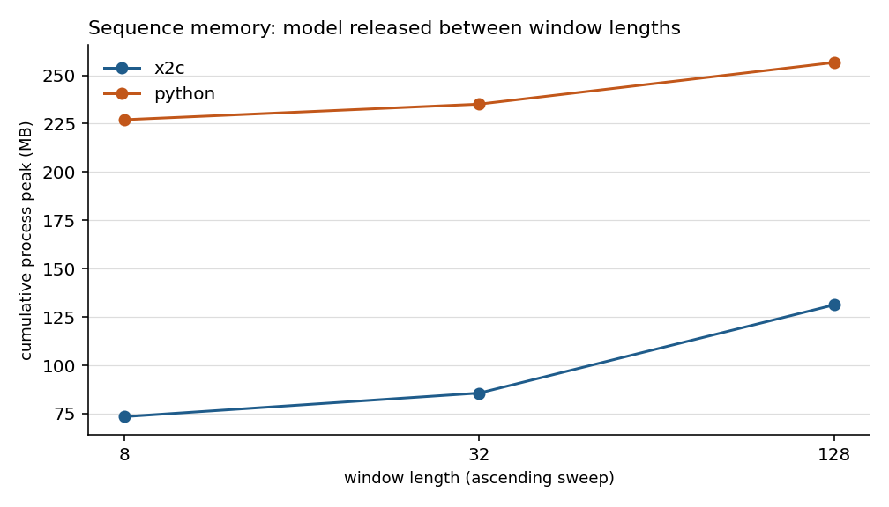
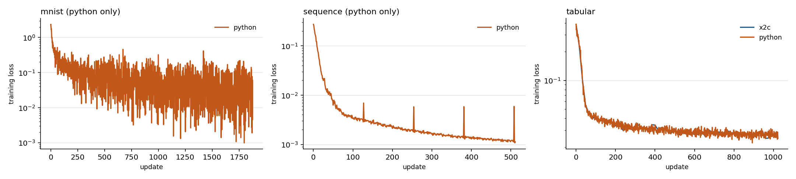

# Supplemental Torch comparison diagnostics

These separate runs close diagnostic coverage gaps. They do not turn diagnostic phase costs into headline performance. The separate counter-free MNIST correction below supersedes only the original 20-warmup timing rows; the original raw records remain intact.

## What ran

- Tree `2b7a63cbb2270eaf1ceba98b31b089fcae56850f` plus uncommitted changes, `x2c 0.12.0`.
- macOS-15.7.9-arm64-arm-64bit-Mach-O, Apple M4 Max, 16 physical and 16 logical cores.
- Build lane `primary`, prefix `/Users/gary/Git/Bonsai-demo/.venv/lib/python3.11/site-packages/torch`, handle counters on.
  - `libtorch_cpu.dylib` 214082912 bytes, SHA-256 `941f3e16a8e02b23`
  - `libtorch.dylib` 16736 bytes, SHA-256 `2178657b7eeffc0c`
  - `libc10.dylib` 1084640 bytes, SHA-256 `f203c171b7a71c74`
- Python at `/Users/gary/Git/Bonsai-demo/.venv/bin/python`, torch `2.10.0`.
- Artifacts, SHA-256 prefixes: `interop-init.pt 7d2ca9e5c1bc`, `mnist-batches.pt d13f17c6f88a`, `mnist-init.pt 8f855dfc9ea5`, `sequence-data.pt 72665ed75b42`, `sequence-init.pt 939cffb5ef4a`, `tabular-batches.pt ebaf4a532b32`, `tabular-data.pt a9465db47665`, `tabular-init.pt bf60a5298a61`.

## Startup, loading and checkpoints

Startup is elapsed fresh process launch through exit after imports, native initialization, thread configuration and a no-work main. It does not isolate dynamic loading from Python import cost. Data loading and model/optimizer setup below follow each application's existing owners: x2c loads initial weights during setup, Python reads them during artifact loading. Compare those two columns together. Tabular setup is the first model/optimizer construction, including lazy Python optimizer imports; MNIST and sequence setup follows their warmup. These boundaries differ across applications. Checkpoint columns include model and optimizer archives, whose native and Python serialization formats differ. These are measured user paths, not identical serialization kernels.

| App | Startup x2c median (s) | Python median (s) |
| --- | --- | --- |
| mnist | 0.1090 | 0.4875 |
| sequence | 0.1127 | 0.5035 |
| tabular | 0.1083 | 0.4992 |

| App/forward | Language | Load (ms) | Setup (ms) | Save (ms) | Reload (ms) |
| --- | --- | --- | --- | --- | --- |
| mnist/native | x2c | 52.442 | 2.174 | 2.585 | 8.305 |
| mnist/native | python | 65.589 | 0.807 | 2.618 | 1.209 |
| sequence/native | x2c | 9.789 | 0.176 | 0.721 | 6.374 |
| sequence/native | python | 1.398 | 0.174 | 0.795 | 0.525 |
| tabular/explicit | x2c | 50.136 | 0.909 | 1.237 | 7.422 |
| tabular/explicit | python | 3.318 | 264.089 | 1.195 | 0.628 |
| tabular/native | x2c | 51.316 | 1.144 | 2.026 | 6.705 |
| tabular/native | python | 3.496 | 258.725 | 1.481 | 0.632 |

## Training phases

Each row is the median of 3 fresh-process diagnostic blocks of 512 updates/windows, after 50 warmup steps and restoring initial model/optimizer state. The matched Adam control is used. Final pre-update losses and recorded reload checks agree across languages.

Clocks and native handle counters are enabled only for these diagnostics. Batch includes slicing and zero_grad; forward includes the loss; optimizer measures step. Cleanup is explicit Scope release or Python del (plus detached sequence carry replacement). Python also destroys intermediates during forward/backward; cleanup is not its total lifetime cost. Per-phase clocks perturb these short blocks; no phase ratio is a headline speedup.

| App/forward | Language | Batch (us/step) | Forward | Backward | Optimizer | Explicit cleanup |
| --- | --- | --- | --- | --- | --- | --- |
| mnist/native | x2c | 62.72 | 6013.56 | 5852.58 | 338.63 | 73.25 |
| mnist/native | python | 84.36 | 6095.13 | 5879.68 | 406.10 | 68.74 |
| sequence/native | x2c | 2.49 | 667.42 | 987.88 | 33.03 | 94.75 |
| sequence/native | python | 13.21 | 1052.23 | 1034.40 | 72.10 | 47.89 |
| tabular/explicit | x2c | 13.00 | 53.46 | 73.22 | 86.91 | 6.41 |
| tabular/explicit | python | 19.86 | 54.87 | 74.23 | 111.74 | 3.36 |
| tabular/native | x2c | 13.37 | 41.89 | 72.41 | 87.66 | 10.47 |
| tabular/native | python | 21.68 | 52.42 | 77.15 | 118.40 | 3.37 |

## Fixed and unique contextual errors

Both variants invoke the same invalid native shape, catch it, and raise a contextual request error. Only the message varies: fixed text or a request number. Every error is followed by a checked valid forward; inference-mode restoration is checked. Error details are not retained in an output log. x2c String and List values are canonical; Python has no corresponding canonical pools.

| Requests | Message | Language | Canonical pool delta (bytes) | End footprint (MB) |
| --- | --- | --- | --- | --- |
| 1024 | fixed | x2c | 512 | 63.6 |
| 1024 | fixed | python | n/a | 155.8 |
| 1024 | unique | x2c | 91136 | 63.5 |
| 1024 | unique | python | n/a | 155.0 |
| 4096 | fixed | x2c | 512 | 63.6 |
| 4096 | fixed | python | n/a | 156.5 |
| 4096 | unique | x2c | 365056 | 65.1 |
| 4096 | unique | python | n/a | 154.5 |

Across x2c error samples, live Scope allocations range 93 to 93, and native tensor handles 7 to 7. The canonical growth is separate from those owners.

## Sequence window length

Each x2c sweep now releases its model and optimizer before the next length, matching Python. The preceding sweep accidentally kept all three models alive and cannot attribute peak changes solely to window length. These corrected supplemental samples supersede that profile only. The plot shows cumulative process high water through the ascending sweep; allocator caches and earlier high water remain in the process, so it is not an isolated per-window allocation peak.

| Window | x2c peak (MB) | Python peak (MB) | x2c model handles after release | Optimizer handles after release |
| --- | --- | --- | --- | --- |
| 8 | 73.5 | 227.0 | 0 | 0 |
| 32 | 85.7 | 235.1 | 0 | 0 |
| 128 | 131.3 | 256.6 | 0 | 0 |

Four-microbatch validation MSE: x2c 0.052508753445; Python 0.052508753445. The comparison passes.

## Interop size grid

Each cell runs 16, 128 and 512 operations using Python, native C++, and the three existing x2c lifetimes. Every result is checked against the C++ output. Timings are single diagnostic observations with counter/sampling overhead, not repeated headline comparisons.

| Elements | Operations | C++ (ns/op) | Python | x2c natural | x2c early-free | x2c shorter-scope |
| --- | --- | --- | --- | --- | --- | --- |
| 1 | 16 | 991 | 1293 | 1128 | 1187 | 1243 |
| 1 | 128 | 779 | 1241 | 1133 | 1165 | 1262 |
| 1 | 512 | 846 | 1207 | 1152 | 1052 | 1252 |
| 64 | 16 | 855 | 1315 | 1356 | 1272 | 1429 |
| 64 | 128 | 904 | 1109 | 1102 | 1471 | 1294 |
| 64 | 512 | 859 | 1196 | 1100 | 1095 | 1256 |
| 4096 | 16 | 1584 | 1801 | 1660 | 1732 | 1721 |
| 4096 | 128 | 1427 | 1768 | 1765 | 1687 | 1781 |
| 4096 | 512 | 1442 | 1752 | 2263 | 1571 | 1813 |
| 65536 | 16 | 18458 | 18400 | 28209 | 18113 | 19337 |
| 65536 | 128 | 17239 | 15562 | 36029 | 18982 | 16591 |
| 65536 | 512 | 14555 | 16269 | 51722 | 17450 | 15152 |

## Paired learning curves from retained outputs

The original Python checks saved their full curves to files but did not emit the curve records consumed by check.json. The original plot therefore showed x2c alone. This paired plot uses unchanged primary x2c records plus the exact retained Python curve files; `paired-curves-provenance.json` records their paths, hashes and point counts beside the primary logs. No training was repeated or original check.json rewritten. Tabular has both languages; MNIST and sequence have Python-only panels because no native learning curves were recorded. Future Python checks now emit their curve records.

## MNIST with 50 warmup batches

The original MNIST timing used 20 warmup batches on both sides, short of the planned 50. Those original rows remain historical in REPORT.md. This separately built counter-free correction warms 50 batches, then constructs the same fresh model and optimizer before timing. Only MNIST is repeated; the other primary workloads are unchanged.

Five fresh-process pairs alternate order at each thread count. The original stock-Adam MNIST numerical counterpart passed and its check/train functions are unchanged. Command-scoped sleep prevention was active and task-owned CPU work was paused. Unrelated desktop applications remained present; the host was not isolated. Spread is (max-min)/median.

| Threads | Updates | x2c median (s) | Spread | Python median (s) | Spread | Python/x2c |
| --- | --- | --- | --- | --- | --- | --- |
| 1 | 1150 | 14.1525 | 2.0% | 14.3631 | 1.4% | 1.01x |
| 4 | 1150 | 9.9758 | 1.3% | 10.2849 | 2.8% | 1.03x |

Correction environment, hashes, binaries and all 20 process logs are retained in `closeout-supplement-mnist50` and the external supplemental evidence.

## Remaining memory limitation

The original canonical-churn runs show over 2x incremental process peak even with a per-request List pool or hoisted handles. Flat Scope and native-handle counts establish those owners' stability; pooling bounds canonical storage. They do not explain the remaining process footprint excess. That residual is unresolved. No allocator-specific cause or general memory-suitability claim is established.

## Reproduction and evidence

Raw supplemental data: `debug/torch-comparison/closeout-supplement/` with `diagnose.json`, `errors-*.json`, `memory.json`, `attribution-e*.json`, environment and one log per process. The [README](README.md) gives the commands. `run.py supplement` and `plots.py --supplement` regenerate this report and its plot without replacing the primary report/plots.
